## Содержание

- [Об игре](#об-игре)
- [Башни](#башни)
- [Враги](#враги)
- [Экономика и прогрессия](#экономика-и-прогрессия)
- [Волны и сложность](#волны-и-сложность)
- [Управление и интерфейс](#управление-и-интерфейс)
- [Платформы и требования](#платформы-и-требования)
- [Лицензия и использование](#лицензия-и-использование)

# ОБ ИГРЕ

Это 2D Tower Defense на Godot 4. Задача игрока — защитить базу от волн врагов, размещая башни на свободных клетках, усиливая их по ходу боя и подстраивая оборону под состав волны. Матч заканчивается победой, если все волны уничтожены, и поражением, если здоровье базы падает до нуля.

В игре есть три режима. **Кампания** предлагает последовательное прохождение уровней с фиксированными картами и заранее заданными волнами. **Песочница** использует автоматически генерируемые волны с постоянным ростом сложности и подходит для теста сборок и рекордов. **PvP** — это онлайн-режим 1 на 1, где оба игрока защищают свои базы на отдельных полях, а победителем становится тот, кто переживёт соперника.

Основа игрового процесса строится на трёх действиях: постройка башен, управление экономикой и реакция на поведение врагов. За уничтожение противников начисляются золото и очки, которые позволяют расширять оборону и улучшать уже построенные башни. Вне боя игрок развивает коллекцию башен через карты, уровни, способности и мастерство.

### Рисунок 1: Базовый игровой цикл
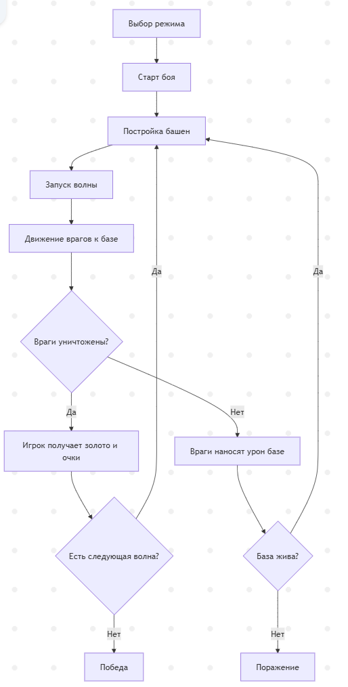

Схема показывает общий цикл матча: игрок строит защиту, запускает волну, получает ресурсы за уничтожение врагов, усиливает оборону и либо проходит все волны, либо проигрывает после потери базы.

---
# БАШНИ

В игре доступно 12 типов башен, разделённых на четыре уровня редкости. Каждая башня имеет 10 уровней улучшения в бою и развивается вне боя через систему карт и мастерства. Характеристики масштабируются в зависимости от уровня карты башни в коллекции игрока.

**Общая таблица башен**

| Название | Редкость | Стоимость постройки | Тип атаки | Основная роль |
|----------|----------|---------------------|-----------|---------------|
| Turret_1 (Пушка) | Обычная | 100 | Одиночная цель | Базовый DPS |
| Turret_2 (Артиллерия) | Обычная | 200 | Область (до 5 целей) | Зачистка групп |
| Turret_3 (Арбалет) | Обычная | 100 | Одиночная цель (фазы) | Всплески урона |
| Turret_4 (Лёд) | Обычная | 100 | Замедление (область) | Контроль скорости |
| Turret_5 (Телепорт) | Обычная | 100 | Отбрасывание | Задержка врагов |
| Turret_6 (Банк) | Обычная | 50 | Нет | Генерация золота |
| Turret_7 (Яд) | Редкая | 100 | Периодический урон | DPS по боссам |
| Turret_8 (Минотавр) | Редкая | 100 | Прямой урон + ловушки | Контроль зоны |
| Turret_9 (Палач) | Эпическая | 200 | Добивание | Финишер |
| Turret_10 (Берсерк) | Легендарная | 100 | Одиночная цель (ярость) | Взрывной урон |
| Turret_11 (Улей) | Легендарная | 400 | Прямой + дроны | Контроль карты |
| Turret_12 (Связка) | Эпическая | 200 | Нет (усиление) | Синергия |

**Стоимость улучшений в бою**

Улучшение одного уровня башни требует от 50 до 3600 золота в зависимости от текущего уровня. Прогрессия одинакова для всех башен:

| Уровень | 1→2 | 2→3 | 3→4 | 4→5 | 5→6 | 6→7 | 7→8 | 8→9 | 9→10 |
|---------|-----|-----|-----|-----|-----|-----|-----|------|------|
| Стоимость | 50 | 75 | 125 | 200 | 325 | 525 | 850 | 1375 | 2225 | 3600 |

При наличии 6+ уровня мастерства карты стоимость улучшений снижается на 2%.

---

**Turret_1 (Пушка)**

Базовая атакующая башня с высокой скорострельностью и стабильным уроном.

| Параметр | Уровень 1 | Уровень 10 | Прирост |
|----------|-----------|------------|---------|
| Урон (карта lvl 0) | 30 | 70.73 | +136% |
| Урон (карта lvl 9) | 70.74 | 166.8 | +136% |
| Снижение разброса урона | 40 | 94.33 | +136% |
| Перезарядка (сек) | 1.0 | 0.7 | -30% |
| Дальность | 245 | 290 | +18% |

**Способности:**
- Уровень 7: шанс 20% выстрелить дважды без задержки
- Уровень 10: критический урон увеличивается на случайную величину 0-40% сверх базового крита

**Применение:** основа ранней обороны, эффективна против одиночных целей и средних волн. Комбинируется с замедлением для максимизации урона.

---

**Turret_2 (Артиллерия)**

Башня для уничтожения групп слабых врагов.

| Параметр | Уровень 1 | Уровень 10 | Прирост |
|----------|-----------|------------|---------|
| Урон (карта lvl 0) | 120 | 190.14 | +58% |
| Урон (карта lvl 9) | 156.57 | 209.72 | +34% |
| Перезарядка (сек) | 1.05 | 0.7 | -33% |
| Дальность | 245 | 290 | +18% |
| Количество целей | 1 | 5 | +400% |

**Способности:**
- Уровень 7: смерть боса пометит случайную ракету. Урон за каждую метку увеличивается на 3%
- Уровень 10: увеличивает шанс критического урона по боссам на 5% от всех ракет
**Применение:** размещается на узких участках пути, где враги скапливаются. Слаба против одиночных боссов, но незаменима для массовых волн.

---

**Turret_3 (Арбалет)**

Башня с режимом чередования фаз атаки.

| Параметр | Уровень 1 | Уровень 10 | Прирост |
|----------|-----------|------------|---------|
| Урон (карта lvl 0) | 15 | 35.38 | +136% |
| Урон (карта lvl 9) | 35.37 | 83.41 | +136% |
| Перезарядка (сек) | 1.0 | 0.7 | -30% |
| Дальность | 230 | 266 | +16% |
| Фаза 1 (обычная, сек) | 2.5 | 6.1 | +144% |
| Фаза 2 (ускорение, сек) | 1.1 | 2.9 | +164% |
| Бонус скорости в фазе 2 | 500% | 500% | - |

**Способности:**
- Уровень 7: шанс 10% остаться в фазе 1 вместо переключения
- Уровень 10: каждая третья фаза 2 наносит урон ×3

**Применение:** эффективна для коротких всплесков урона по приоритетным целям. В фазе 2 становится одной из самых быстрых башен в игре.

---

**Turret_4 (Лёд)**

Башня контроля, замедляющая врагов в радиусе действия.

| Параметр | Уровень 1 | Уровень 10 | Прирост |
|----------|-----------|------------|---------|
| Интенсивность замедления (%) | 5 | 27.8 | +456% |
| Длительность эффекта (сек) | 1.0 | 1.18 | +18% |
| Перезарядка (сек) | 1.5 | 1.2 | -20% |
| Дальность | 340 | 430 | +26% |

**Способности:**
- Уровень 7: наносит урон = 1% от текущего HP каждого замедленного врага
- Уровень 10: урон по боссам увеличен до 5% HP

**Применение:** не наносит прямого урона без способностей, но критически важна для контроля темпа волн. Комбинируется с высокоуроновыми башнями.

---

**Turret_5 (Телепорт)**

Башня для отбрасывания врагов назад по пути.

| Параметр | Уровень 1 | Уровень 10 | Прирост |
|----------|-----------|------------|---------|
| Процент отбрасывания (%) | 5.5 | 18.3 | +233% |
| Перезарядка (сек) | 4.0 | 2.52 | -37% |
| Дальность | 245 | 290 | +18% |

**Способности:**
- Уровень 7: шанс 10% отбросить врага на двойное расстояние
- Уровень 10: мгновенно убивает врагов с HP < 10%

**Применение:** увеличивает время прохождения врагов. Эффективна против быстрых юнитов и в комбинации с замедлением. Не используется для прямого уничтожения.

---

**Turret_6 (Банк)**

Башня для пассивной генерации золота.

| Параметр | Уровень 1 | Уровень 10 | Прирост |
|----------|-----------|------------|---------|
| Доход за цикл | 5 | 18.3 | +266% |
| Перезарядка (сек) | 3.0 | 1.89 | -37% |

**Способности:**
- Уровень 7: увеличивает количество золота добываемое с убийства врага на 1 единицу
- Уровень 10: доход +1% за каждую построенную башню этого типа

**Применение:** не участвует в бою. Строится на длинных волнах для накопления ресурсов. Синергия с множественными копиями делает её экспоненциально эффективной.

---

**Turret_7 (Яд)**

Башня для наложения периодического урона.

| Параметр | Уровень 1 | Уровень 10 | Прирост |
|----------|-----------|------------|---------|
| Урон за тик (карта lvl 0) | 30 | 129.02 | +330% |
| Урон за тик (карта lvl 9) | 127.9 | 486.4 | +280% |
| Перезарядка (сек) | 1.0 | 0.7 | -30% |
| Дальность | 245 | 290 | +18% |
| Длительность яда (сек) | 4.0 | 4.0 | - |
| Интервал тика (сек) | 1.1 | 0.58 | -47% |

**Способности:**
- Уровень 7: отравленные враги передвигаются на 5% медленнее
- Уровень 10: шанс 5% отравить двух врагов одновременно

**Применение:** наносит урон постепенно, поэтому слаба против быстрых врагов. Эффективна по боссам с большим запасом HP. Яд продолжает действовать после выхода врага из радиуса.

---

**Turret_8 (Минотавр)**

Башня с прямой атакой и установкой ловушек на пути врагов.

| Параметр | Уровень 1 | Уровень 10 | Прирост |
|----------|-----------|------------|---------|
| Урон (карта lvl 0) | 50 | 190.14 | +280% |
| Урон (карта lvl 9) | 127.9 | 486.4 | +280% |
| Перезарядка (сек) | 3.0 | 2.5 | -17% |
| Дальность | 245 | 290 | +18% |
| Урон ловушки (карта lvl 0) | 200 | 511.62 | +156% |
| Урон ловушки (карта lvl 9) | 511.61 | 1308.72 | +156% |
| Интервал установки (сек) | 4.0 | 2.53 | -37% |

**Способности:**
- Уровень 7: при повышении уровня, появлении Минотавра начисляется заряд ярости, и все Минотавры входят в режим берсерка на 10с. В этом режиме урон вызываемых землетрясений увеличивается на 50% и дополнительно на 1% за каждый заряд ярости
- Уровень 10: каждый заряд ярости увеличивает действия режима берсерка на 1 секунду. Максимум 30 секунд

**Применение:** ловушки размещаются случайно на пути, существуют 3 секунды, замедляют на 30% и наносят периодический урон. Эффективна против медленных плотных волн.

---

**Turret_9 (Палач)**

Башня для мгновенного добивания врагов с низким HP.

| Параметр | Уровень 1 | Уровень 10 | Прирост |
|----------|-----------|------------|---------|
| Урон (карта lvl 0) | 120 | 220.62 | +84% |
| Урон (карта lvl 9) | 128.4 | 236.06 | +84% |
| Перезарядка (сек) | 1.0 | 0.7 | -30% |
| Дальность | 245 | 290 | +18% |
| Порог добивания (% HP) | 9 | 17.58 | +95% |

**Способности:**
- Уровень 7: урон после добивания ×3 на один выстрел
- Уровень 10: порог добивания работает на боссах

**Применение:** мгновенно убивает врагов, HP которых ниже порога. Без способности 2 бесполезна против боссов. Ставится после башен, которые равномерно снижают HP группы.

---

**Turret_10 (Задира)**

Башня с режимом ярости для взрывного урона.

| Параметр | Уровень 1 | Уровень 10 | Прирост |
|----------|-----------|------------|---------|
| Урон (карта lvl 0) | 50 | 190.14 | +280% |
| Урон (карта lvl 9) | 127.9 | 486.4 | +280% |
| Перезарядка (сек) | 1.0 | 0.7 | -30% |
| Дальность | 245 | 290 | +18% |
| Бонус урона в ярости (%) | 60 | 113.95 | +90% |
| Бонус скорости в ярости (%) | 70 | 151.92 | +117% |

**Способности:**
- Уровень 7: шанс 5% войти в усиленную ярость с уроном +1000% на 3 сек при атаке босса
- Уровень 10: урон +10% за каждого врага на карте, максимум +100%

**Применение:** автоматически входит в ярость при виде босса или >5 врагов. В ярости резко возрастают урон и скорость, но после режима башня не атакует 3 секунды. Подходит для финальных волн.

---

**Turret_11 (Улей дронов)**

Башня, создающая автономных дронов для патрулирования карты.

| Параметр | Уровень 1 | Уровень 10 | Прирост |
|----------|-----------|------------|---------|
| Урон башни (карта lvl 0) | 10 | 35.16 | +252% |
| Урон башни (карта lvl 9) | 23.58 | 82.97 | +252% |
| Перезарядка (сек) | 1.0 | 0.7 | -30% |
| Дальность | 245 | 290 | +18% |
| Урон дронов (карта lvl 0) | 50 | 190.14 | +280% |
| Урон дронов (карта lvl 9) | 127.9 | 486.4 | +280% |
| Интервал запуска дронов (сек) | 20 | 20 | - |
| Длительность жизни дронов (сек) | 15 | 15 | - |
| Интервал атаки дронов (сек) | 0.6 | 0.42 | -30% |

**Способности:**
- Уровень 7: шанс 50% создать третьего дрона
- Уровень 10: каждый жетон, принесённый дронами, увеличивает урон следующего поколения на 2% вместо 1%

**Применение:** каждые 20 секунд создаёт 2 дрона (3 с способностью 1). Дроны атакуют по стратегиям: Scout (самый дальний), Interceptor (самый близкий к базе), Random. Дроны накапливают жетоны за убийства, усиливающие следующую волну дронов. Контролируют всю карту.

---

**Turret_12 (Связка)**

Башня для усиления соседних башен без прямой атаки.

| Параметр | Уровень 1 | Уровень 10 | Прирост |
|----------|-----------|------------|---------|
| Урон (используется редко) | 50 | 190.14 | +280% |
| Перезарядка (сек) | 1.0 | 0.7 | -30% |
| Дальность | 245 | 290 | +18% |
| Бонус урона соседям (%) | 10 | 10 | - |

**Способности:**
- Уровень 7: если ≥6 башен одного типа в сети, их скорость атаки ×2 
- Уровень 10: бонус к урону для всех связанных башен увеличивается до +15%

**Применение:** усиливает все башни на одной линии (вертикаль/горизонталь) на 10% урона. Если связанная башня критует, все остальные получают гарантированный крит на следующий выстрел. Не атакует врагов. Оптимальна для групп однотипных башен.

---

### Рисунок 2: Комбинации башен для разных задач
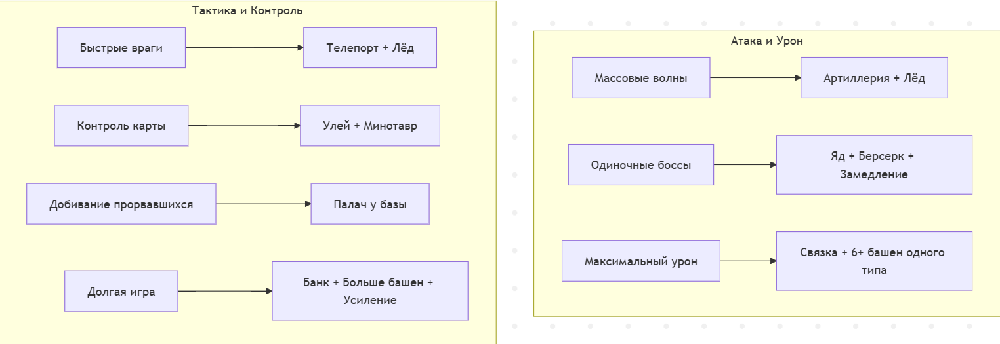

Схема показывает оптимальные комбинации башен под конкретные задачи. Массовые волны требуют урона по области с замедлением. Боссы уничтожаются периодическим уроном и взрывными атаками. Быстрые враги контролируются отбрасыванием и замедлением. Экономические стратегии строятся на банках. Синергия однотипных башен усиливается связкой.

---

# ВРАГИ

В игре присутствуют 8 типов обычных врагов и 13 боссов. Обычные враги движутся по заданному пути, имеют фиксированные HP и скорость. Боссы обладают уникальными способностями, влияющими на игровой процесс. Характеристики всех врагов масштабируются с номером волны: HP увеличивается на процент, зависящий от настроек сложности, а скорость остаётся постоянной.

**Обычные враги**

Базовые характеристики указаны для первой волны. На каждой последующей волне HP растёт экспоненциально.

| ID | Имя | Базовое HP | Скорость | Награда (золото) | Особенности |
|----|-----|------------|----------|------------------|-------------|
| 1 | Enemy_1 | 85 | 155 | 10.5 | Базовый враг без способностей |
| 2 | Enemy_2 | 90 | 145 | 11.0 | Чуть медленнее, больше HP |
| 3 | Enemy_3 | 90 | 160 | 11.5 | Быстрый легкий враг |
| 4 | Enemy_4 | 130 | 190 | 12.0 | Очень быстрый средний враг |
| 5 | Enemy_5 | 135 | 120 | 13.0 | Медленный танк |
| 6 | Enemy_6 | 135 | 200 | 13.0 | Самый быстрый средний враг |
| 7 | Enemy_7 | 200 | 210 | 13.0 | Быстрый танк |
| 8 | Enemy_8 | 400 | 150 | 15.0 | Тяжёлый танк |

**Поведение обычных врагов:**
- движутся строго по заданному пути без отклонений;
- не атакуют башни, только наносят урон базе при достижении конца пути;
- могут быть замедлены, отброшены, отравлены, заморожены;
- могут подобрать бонус скорости с дороги (от BOSS_10);
- урон базе равен значению параметра `damage` (по умолчанию 1).

---

**Боссы**

Боссы появляются в конце каждой волны. Каждый босс имеет уникальную механику, влияющую на игру.

**Базовые характеристики боссов**

| ID | Имя | Базовое HP | Скорость | Награда | Особенность |
|----|-----|------------|----------|---------|-------------|
| 1 | Каменная горгулья | 1500 | 75 | 20.0 | Окаменяет башни |
| 2 | Бронированный титан | 800 | 220 | 20.0 | Блокирует урон |
| 3 | Водный элементаль | 920 | 100 | 20.0 | Заливает дорогу водой |
| 4 | Призыватель | 1150 | 105 | 20.0 | Призывает врагов |
| 5 | Регенератор | 1150 | 100 | 20.0 | Восстанавливает HP |
| 6 | Разрушитель | 800 | 140 | 20.0 | Уничтожает башню |
| 7 | Пожиратель мощности | 750 | 150 | 20.0 | Ослабляет башни |
| 8 | Споровый культиватор | 950 | 200 | 20.0 | Заражает башни |
| 9 | Призрак | 600 | 120 | 20.0 | Чередует неуязвимость |
| 10 | Гонец | 800 | 150 | 20.0 | Создаёт бонусы скорости |
| 11 | Медик | 500 | 140 | 20.0 | Лечит свиту |
| 12 | Поглотитель всплесков | 800 | 85 | 20.0 | Сопротивляется AoE и замедлению |
| 13 | Дракон | 1120 | 80 | 25.0 | Снижает уровень башен |

**Детальное описание способностей боссов**

**BOSS_1 (Каменная горгулья)**
- Каждые 3 секунды выбирает 3 случайные башни и окаменяет их на 5 секунд
- Окаменевшая башня не может атаковать и покрывается каменной текстурой
- Башни с эффектом защиты от Связки (Turret_12) игнорируют окаменение
- Приоритет окаменения: башни без защиты → случайный выбор

**BOSS_2 (Бронированный титан)**
- Блокирует 10% всего входящего урона (множитель 0.9)
- Эффект работает против всех типов урона: прямого, периодического, добивания
- Не имеет иммунитета к замедлению или отбрасыванию

**BOSS_3 (Водный элементаль)**
- При появлении на карте заливает всю дорогу водой на время жизни босса
- Все враги на карте получают +20% скорости (включая самого босса)
- Вода исчезает после смерти босса
- Визуально отображается синей текстурой на клетках пути

**BOSS_4 (Призыватель)**
- Каждые 5 секунд призывает 3-5 случайных обычных врагов
- Призванные враги появляются на текущей позиции босса с отставанием 30 единиц пути
- Враги имеют характеристики, соответствующие текущей волне
- Может вызвать любого из Enemy_1 - Enemy_8

**BOSS_5 (Регенератор)**
- Каждые 5 секунд восстанавливает 5% от **максимального** HP
- Регенерация не прерывается уроном
- Эффективен против низкоуронных башен
- Добивание Палачом (Turret_9) останавливает регенерацию

**BOSS_6 (Разрушитель)**
- При появлении на карте случайно выбирает одну построенную башню и мгновенно уничтожает её
- Не возвращает золото за уничтоженную башню
- Может уничтожить башню любого типа, включая Связку
- Не может уничтожить башни, защищённые эффектом Связки

**BOSS_7 (Пожиратель мощности)**
- За каждое попадание башня навсегда теряет 0.1% урона (накапливается)
- Эффект сохраняется на башне до конца матча
- Множественные попадания складываются: 10 выстрелов = -1% урона
- Наиболее опасен для быстрых башен (Арбалет в фазе 2, Берсерк)
- Не влияет на башни, не наносящие прямого урона (Лёд, Телепорт, Банк)

**BOSS_8 (Споровый культиватор)**
- Заражает спорами все башни, мимо которых проходит (радиус 60 единиц)
- Заражённые башни атакуют на 20% медленнее (множитель перезарядки 0.2)
- Визуально отображается иконкой растения на башне
- Споры исчезают после смерти босса
- Не заражает башни без атаки (Банк, Связка)

**BOSS_9 (Призрак)**
- Чередует фазы уязвимости и неуязвимости каждые 3 секунды
- В фазе неуязвимости полностью игнорирует весь урон
- Визуально: полупрозрачность 0.392 в фазе неуязвимости, 1.0 в фазе уязвимости
- Замедление и отбрасывание действуют в обеих фазах

**BOSS_10 (Гонец)**
- При смерти создаёт 3 бонуса скорости на случайных клетках дороги
- Враг, подобравший бонус, получает +20% скорости навсегда (максимум +60%)
- Бонусы существуют до конца волны или подбора
- Визуально отображаются яркой иконкой на дороге
- Быстрые враги (Enemy_4, Enemy_6, Enemy_7) становятся критически опасными с этим баффом

**BOSS_11 (Медик)**
- Появляется с 3 врагами-детьми (Enemy_11_1 с вариантами текстур 1, 2, 3)
- Каждые 3 секунды восстанавливает всем детям 3% от их **текущего** HP
- При смерти детей лечение прекращается
- При смерти босса дети остаются на карте
- Дети имеют половину HP босса и его скорость

**BOSS_12 (Поглотитель всплесков)**
- Урон от башен с типом атаки AREA снижен на 75% (делится на 4)
- Любое замедление **ускоряет** босса вместо замедления
- Максимальная скорость: 250% от базовой
- Эффект замедления Лёд (Turret_4) даёт боссу +10% скорости вместо -10%
- Лечение от замедления увеличивает HP (урон с отрицательным знаком)

**BOSS_13 (Дракон)**
- При входе в радиус 60 единиц от башни снижает её уровень на 1
- Башни уровня 1 не могут быть понижены
- Эффект срабатывает один раз за прохождение мимо башни
- Визуально: взрыв эффекта на башне при снижении уровня
- Параметры башни мгновенно пересчитываются в соответствии с новым уровнем

---

### Рисунок 3: Жизненный цикл врага

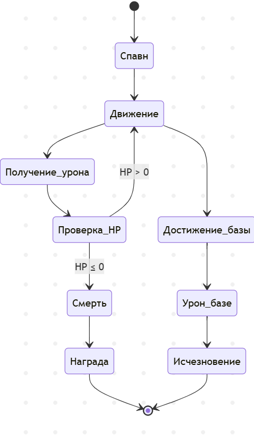

Схема показывает полный цикл существования врага: от спавна до смерти или достижения базы. Враг может быть уничтожен башнями (награда игроку) или дойти до базы (урон базе без награды).

---

### Рисунок 4: Активация способностей боссов по типам

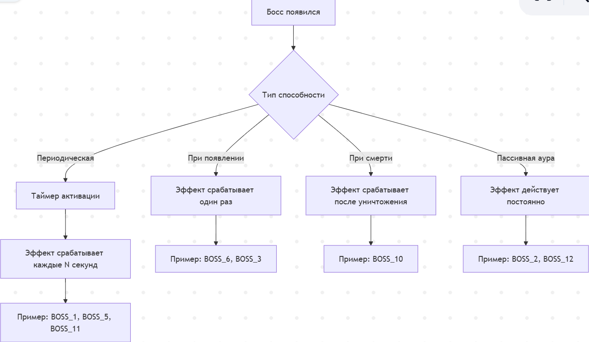

Схема классифицирует способности боссов по времени активации. Периодические способности срабатывают по таймеру. Способности при появлении активируются сразу. Способности при смерти влияют на игру после уничтожения босса. Пассивные ауры действуют всё время жизни босса.

---

# ЭКОНОМИКА И ПРОГРЕССИЯ

Игра использует две параллельные системы прогрессии: внутриматчевую экономику (золото, очки, улучшения в бою) и внешнюю прогрессию (карты башен, мастерство, критический урон, достижения, путь к славе). Внутриматчевые ресурсы сбрасываются после окончания боя, внешние накапливаются навсегда.

---

**Золото в бою**

Золото используется только в рамках одного матча и не переносится между боями. Основные источники:

| Источник                      | Количество   | 
|-------------------------------|--------------|
| Стартовый капитал (Кампания)  | 500-1000     |
| Стартовый капитал (Песочница) | 500          |
| Стартовый капитал (PvP)       | 500          |               
| Убийство обычного врага       | 10-15 базово |                                       
| Убийство босса                | 20-25 базово | 
| Генерация башней Банк         | 5-18 за цикл | 

**Траты золота в бою:**

| Действие | Стоимость  |
|----------|------------|
| Постройка  башни | 50-400     |
| Улучшение башни (уровень 1→2) | 50  - 3600 |

Неиспользованное золото остаётся доступным на следующей волне.

---

**Очки матча**

Очки начисляются только за убийство врагов и влияют на итоговую награду в режиме Кампания.

```
Очки за врага = (Базовая награда золотом / 2) × (Номер волны / 3)
```

Пример: убийство Enemy_1 (базовая награда 10.5 золота) на волне 10 даёт `(10.5 / 2) × (10 / 3) = 17.5` очков.

Очки не влияют на игровой процесс напрямую, но определяют количество звёзд в Кампании и размер награды.

---

**Система карт башен**

Каждая башня имеет карту в коллекции игрока. Карта имеет два параметра: **уровень карты** (0-9) и **количество накопленных карт**.

**Прогрессия уровня карты:**

| Уровень карты | Обычная | Редкая | Эпическая | Легендарная |
|---------------|---------|--------|-----------|-------------|
| 0 → 1 | 2 | 4 | 8 | 15 |
| 1 → 2 | 4 | 8 | 15 | 25 |
| 2 → 3 | 8 | 15 | 25 | 40 |
| 3 → 4 | 15 | 25 | 40 | 60 |
| 4 → 5 | 25 | 40 | 60 | 90 |
| 5 → 6 | 40 | 60 | 90 | 130 |
| 6 → 7 | 60 | 90 | 130 | 180 |
| 7 → 8 | 90 | 130 | 180 | 250 |
| 8 → 9 | 130 | 180 | 250 | 350 |
При повышении уровня карты накопленные карты сгорают в количестве, указанном в таблице.

**Эффект уровня карты:**

Уровень карты определяет базовые характеристики башни в бою. 

**Источники карт:**

- Награда за победу в матче (зависит от количества звёзд)
- Открытие сундуков (ежедневные награды, путь к славе, достижения)
- Покупка в магазине за золото (вне боя)

**Стоимость повышения уровня карты вне боя:**

При достаточном количестве карт игрок может повысить уровень карты, заплатив золото вне боя.

---

**Критический урон**

Критический урон — это глобальный множитель, который применяется ко всем критическим попаданиям всех башен во всех матчах. Базовый шанс критического удара для всех башен — 5%.

**Источники критического урона:**

| Действие | Прирост |
|----------|---------|
| Покупка новой карты башни | +1% |
| Повышение уровня карты | +1% |
| Награды за достижения | +10-50% |

Критический урон накапливается бессрочно и не сбрасывается. Например, если у игрока критический урон 50%, то все критические удары всех башен наносят на 50% больше урона.

**Формула критического урона:**

```
Урон башни с критом = Базовый урон × (1 + Критический урон / 100)
```

Пример: башня наносит 100 урона, критический урон игрока 50%. Обычный удар = 100, критический = 100 × 1.5 = 150.

---

**Система мастерства**

Каждая башня накапливает опыт мастерства за использование в бою. Опыт сохраняется между матчами и повышает уровень мастерства башни. Максимальный уровень мастерства — 10.

**Накопление опыта мастерства:**

| Действие | XP за действие | Применяется к башням |
|----------|----------------|----------------------|
| Нанесение урона | +1 XP за каждые 1 000 000 урона | Все атакующие башни |
| Убийство врага | +1 XP за каждые 1 000 убийств | Все атакующие башни |
| Генерация золота | +1 XP за каждые 100 золота | Только Банк (Turret_6) |
| Замедление врагов | +1 XP за каждые 100 000 замедлений | Только Лёд (Turret_4) |

Опыт начисляется **по окончании матча**, а не в реальном времени. 

**Требования XP для уровней мастерства:**

| Уровень | Требуется XP | Накопленный XP |
|---------|--------------|----------------|
| 1 | 1000 | 1000 |
| 2 | 2500 | 3500 |
| 3 | 5000 | 8500 |
| 4 | 10000 | 18500 |
| 5 | 20000 | 38500 |
| 6 | 35000 | 73500 |
| 7 | 50000 | 123500 |
| 8 | 75000 | 198500 |
| 9 | 100000 | 298500 |
| 10 | 150000 | 448500 |

**Бонусы уровней мастерства:**

| Уровень | Бонус | Описание                                                       |
|---------|-------|----------------------------------------------------------------|
| 1 | +1% урон | Увеличивает базовый урон башни на 1%                           |
| 2 | +1% скорость атаки | Снижает перезарядку на 1%                                      |
| 3 | -1% стоимость постройки | Снижает стоимость постройки в бою на 1%                        |
| 4 | +2% шанс крита | Увеличивает шанс критического урона на 2%                      |
| 5 | Уникальный скин | Косметическое изменение внешнего вида                          |
| 6 | +2% урон | Увеличивает базовый урон башни на 2% (суммируется с 1 уровнем) |
| 7 | -2% стоимость улучшений | Снижает стоимость улучшений в бою на 2%                        |
| 8 | +2% скорость атаки | Снижает перезарядку на 2% (суммируется со 2 уровнем)           |
| 9 | +5% урон по боссам | Увеличивает урон по боссам на 5%                               |
| 10 | Уникальный скин | Второй косметический вариант                                   |

Бонусы **суммируются**. Например, башня с 8 уровнем мастерства имеет:
- +3% урон (1 + 2%)
- +3% скорость атаки (1 + 2%)
- -1% стоимость постройки
- +2% шанс крита
- -2% стоимость улучшений
- 1 уникальный скин

---

**Путь к славе**

Глобальная система прогрессии, основанная на накоплении опыта и получении наград за прохождение уровней. Включает два пути: бесплатный и VIP (премиум).

**Накопление опыта пути к славе:**

Опыт начисляется за участие в матчах. Зависит от:
- длительности матча;
- количества уничтоженных врагов;
- количества пройденных волн;
- результата матча (победа/поражение).

**Уровни и требования:**

| Уровень | Требуется опыта | Награда (бесплатный путь) | Награда (VIP путь) |
|---------|-----------------|---------------------------|--------------------|
| 1 | 20 | Сундук уровня 2 (3 карты) | Сундук уровня 3 (5 карт) |
| 2 | 30 | Сундук уровня 3 (2+2 карты) | Сундук уровня 5 (3+3 карты) |
| 3 | 40 | Сундук уровня 4 (3+3+1 карт) | Сундук уровня 6 (4+4+2 карты) |
| 4 | 50 | Сундук уровня 5 (3+3+1 карт) | Сундук уровня 7 (4+4+2 карты) |
| 5 | 60 | 10 золота | Сундук уровня 8 (5+5+1 карт) |
| 6 | 70 | Сундук уровня 6 (5+5+1 карт) | 15 золота |
| 7 | 80 | Сундук уровня 7 (5+5+1 карт) | Сундук уровня 9 (6+7+2 карты) |
| 8 | 90 | Сундук уровня 8 (5+5+1 карт) | Сундук уровня 9 (5+5+2 карты) |

**Формат наград в таблице:**

`[количество обычных + редких + эпических карт]` или фиксированное количество золота.

VIP путь открывается за реальные деньги (или другую внутриигровую валюту, не указано в коде). VIP путь даёт дополнительные награды за те же уровни.

**Механика получения наград:**

После достижения уровня игрок должен **вручную** забрать награду. Награды не выдаются автоматически. Если игрок не забрал награду за уровень 3 и достиг уровня 5, он может забрать обе награды одновременно.

---

**Достижения (Promotion)**

Система долгосрочных целей, разделённая на 7 категорий. За выполнение достижений начисляются звёзды опыта, которые повышают общий уровень достижений.

**Категории достижений:**

| ID | Название | Задача | Уровни прогресса |
|----|----------|--------|------------------|
| 1 | Матчи сыграны | Завершить N матчей | 1, 10, 50, 100, 1000 |
| 2 | Золото потрачено | Потратить N золота | 50, 250, 500, 5000, 50000 |
| 3 | Матчи кампании | Завершить N матчей кампании | 1, 3, 5, 10, 50 |
| 4 | Победные серии | Победить N раз подряд | 2, 3, 5, 7, 10 |
| 5 | Урон нанесён | Нанести N урона | 10, 50, 100, 250, 500 (×1000) |
| 6 | Уникальные победы | Победить на N разных картах | 2, 3, 5, 10, 15 |
| 7 | Победа с 1 HP | Победить с 1 единицей здоровья базы | 1, 5, 10, 25, 50 |

**Награды за уровни достижений:**

| Уровень в категории | Звёзды опыта |
|---------------------|--------------|
| 1 | 10 |
| 2 | 50 |
| 3 | 100 |
| 4 | 500 |
| 5 | 1000 |

**Прогрессия общего уровня достижений:**

Накопленные звёзды повышают общий уровень. Каждый уровень требует больше звёзд.

| Общий уровень | Требуется звёзд | Награда |
|---------------|-----------------|---------|
| 1 | 10 | 50 золота + сундук уровня 2 |
| 3 | 50 | 10 золота + сундук уровня 4-5 |
| 5 | 80 | 10 золота + 20 золота |
| 10 | 200 | 10 золота + 30 золота |
| 15 | 400 | 10 золота + сундук уровня 5 |
| 20 | 700 | 10 золота + 40 золота |
| 25 | 1000 | 10 золота + 45 золота |
| 30 | 1500 | 20 золота + сундук уровня 20 |

---

**Ежедневные и еженедельные задания**

Система краткосрочных задач, обновляющихся каждый день и каждую неделю.

**Ежедневные задания (4 шт):**

Обновляются каждый день (проверка по UTC). Задания выбираются случайно из 12 типов задач:

| Тип задачи | Диапазон прогресса | Награда (золото) |
|------------|--------------------|------------------|
| Нанести урон | 10000-25000 | 5 за единицу |
| Уничтожить врагов | 30-100 | 3 за единицу |
| Получить обычные карты башен | 2-5 | 4 за единицу |
| Получить редкие карты башен | 2-5 | 5 за единицу |
| Получить эпические карты башен | 1-2 | 8 за единицу |
| Улучшить башни | 1-2 | 2 за единицу |
| Заработать золото | 10-30 | 2 за единицу |
| Заработать алмазы | 1-2 | 5 за единицу |

**Еженедельные задания (7 шт):**

Обновляются каждую неделю. Задания аналогичны ежедневным, но требуют больше прогресса и дают **жетоны** вместо золота.

| Тип задачи | Диапазон прогресса | Награда (жетоны) |
|------------|--------------------|------------------|
| Нанести урон | 10000-100000 | 5 за единицу |
| Уничтожить врагов | 30-500 | 3 за единицу |
| Получить обычные карты башен | 2-30 | 4 за единицу |
| Получить редкие карты башен | 2-30 | 5 за единицу |
| Получить эпические карты башен | 1-5 | 8 за единицу |

Жетоны используются для покупки эксклюзивных предметов в магазине.

**Карьерные задания:**

Постоянные задания, разделённые на этапы. Каждый этап содержит 2 задания. После выполнения всех заданий этапа игрок получает награду в виде сундука.

Пример этапа 1:
- Задание 1: Уничтожить 12 врагов
- Задание 2: Нанести 13000 урона
- Награда: сундук уровня 5

Этапы не сбрасываются и доступны всегда.

---

### Рисунок 5: Схема прогрессии игрока

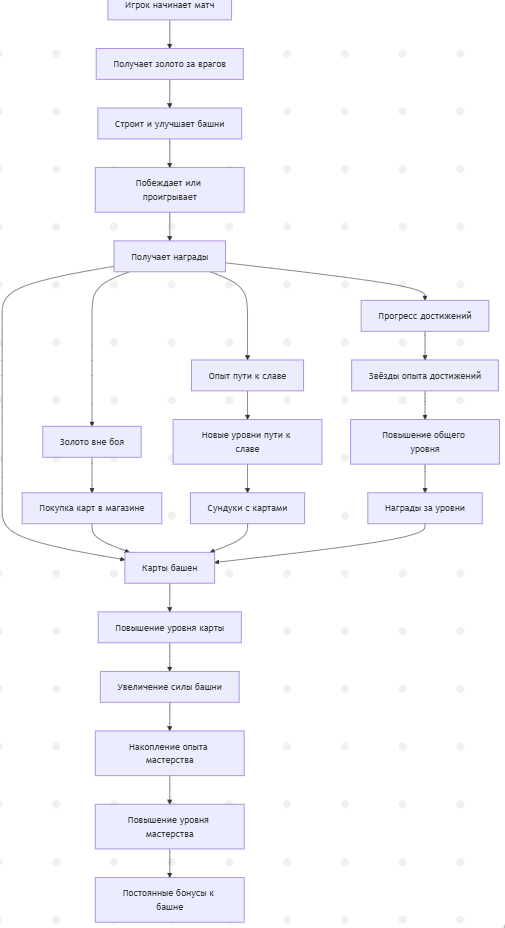

Схема показывает замкнутый цикл прогрессии: участие в матчах → получение наград → усиление башен → участие в более сложных матчах. Внутриматчевое золото не влияет на внешнюю прогрессию. Карты башен — основной ресурс для развития.

---

### Рисунок 6: Система наград после матча

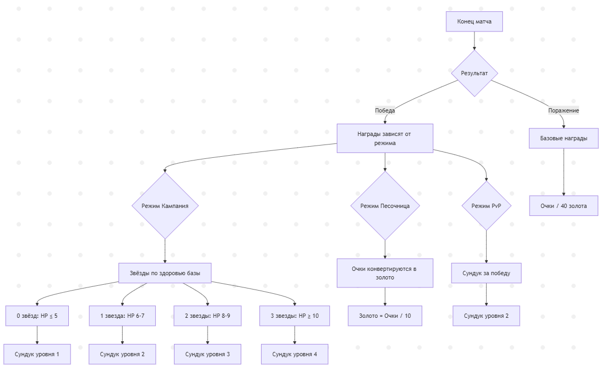


Схема показывает логику распределения наград. В Кампании награда зависит от здоровья базы. В Песочнице награда зависит от очков. В PvP награда фиксирована за победу. Поражение даёт минимальные награды.

---

# ВОЛНЫ И СЛОЖНОСТЬ

Игра использует систему волн — последовательных атак групп врагов на базу игрока. Каждая волна сложнее предыдущей благодаря росту характеристик врагов и усложнению их состава. Сложность масштабируется автоматически в зависимости от номера волны и настроек игрока.

---

**Структура волны**

Волна состоит из списка врагов и временных интервалов между их появлением

Волны генерируются по-разному в зависимости от режима игры.

**Режим Кампания:**

Волны заранее заданы. Каждый уровень имеет фиксированное количество волн и строго определённый состав врагов

Боссы появляются на определённых волнах каждого уровня (не в каждом уровне).

**Режим Песочница:**

Волны генерируются автоматически. После генерации всех врагов добавляется случайный босс (BOSS_1 - BOSS_13)

**Режим PvP:**

Волны генерируются сервером и одинаковы для обоих игроков. Используется тот же алгоритм, что и для Песочницы, но без случайного босса в каждой волне.

---

**Система подарочных волн**

В некоторых режимах (не Кампания) после определённых волн игроку предлагается выбрать один из трёх подарков. 

**Типы подарков:**

Игрок выбирает одну башню из четырёх доступных. Для выбранной башни применяется один из модификаторов:

| Модификатор | Эффект | Длительность |
|-------------|--------|--------------|
| Урон | +1% к урону | До конца матча |
| Скорость атаки | -1% к перезарядке | До конца матча |
| Дальность | +1% к радиусу атаки | До конца матча |

Модификаторы применяются **ко всем башням выбранного типа**, построенным и будущим.

---

**Особые механики волн**

**Пауза между волнами:**

После уничтожения всех врагов волны игрок имеет 5 секунд паузы перед автоматическим стартом следующей волны. Игрок может:
- использовать паузу для постройки и улучшения башен;
- использовать ускорение времени (×4 скорость).

**Проверка окончания матча:**

Матч заканчивается, когда:
- **Победа:** все враги всех волн уничтожены, здоровье базы > 0
- **Поражение:** здоровье базы ≤ 0

В режиме Песочница матч продолжается до поражения (бесконечные волны).

---

### Рисунок 7: Алгоритм генерации волны в Песочнице
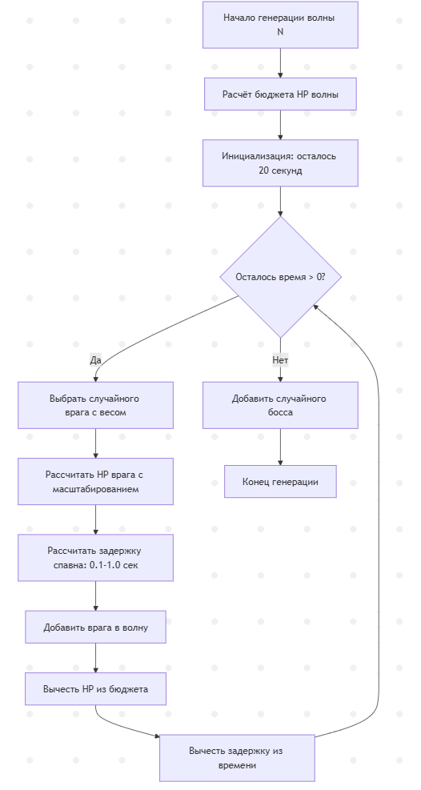

Схема показывает процесс генерации волны. Генератор итеративно добавляет врагов, пока не закончится время или бюджет HP. В конце добавляется босс для усложнения.

---

### Рисунок 8: Рост сложности волн
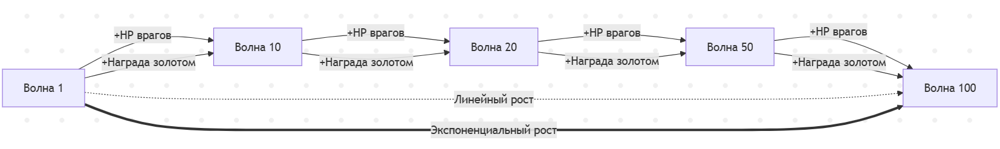

Схема показывает разницу в темпах роста награды (линейный) и HP врагов (экспоненциальный). С каждой волной враги становятся значительно сильнее, а награда растёт медленнее. Это создаёт возрастающую сложность.

---

**Баланс сложности**

Игра балансируется вокруг двух кривых:

1. **Кривая силы игрока:**
   - Растёт благодаря золоту, улучшениям башен, новым башням
   - Зависит от стратегии игрока
   - Может расти линейно или экспоненциально (при правильном управлении экономикой)

2. **Кривая силы врагов:**
   - Растёт экспоненциально благодаря формуле масштабирования HP
   - Не зависит от действий игрока
   - Неизбежно превосходит силу игрока на длинных дистанциях

**Точка поражения:**

Рано или поздно кривая силы врагов пересекает кривую силы игрока. После этой точки игрок не может наносить достаточно урона, чтобы уничтожать всех врагов, и начинает пропускать их к базе.

**Стратегии выживания:**

- **Экономический бум:** строить банки на ранних волнах для накопления капитала
- **Максимизация урона:** фокусироваться на высокоуроновых башнях и критах
- **Контроль темпа:** замедление и отбрасывание для увеличения времени под огнём
- **Синергии:** использовать Связку для усиления однотипных башен
- **Добивание:** использовать Палача для гарантированного уничтожения прорвавшихся врагов

---

**Таблица критических волн**

Некоторые волны имеют особое значение в прогрессии:

| Волна | Событие | Сложность |
|-------|---------|-----------|
| 1-5 | Начальная фаза | Лёгкая |
| 6-10 | Появление средних врагов | Средняя |
| 11-15 | Первые боссы | Высокая |
| 16-20 | Первая проверка защиты | Очень высокая |
| 21-30 | Экспоненциальный рост HP | Экстремальная |
| 31-50 | Предел большинства стратегий | Невозможная без идеальной сборки |
| 51+ | Предел даже идеальных стратегий | Практически непроходимая |

После волны 30 большинство игроков терпят поражение. Волны 50+ достижимы только с идеальным балансом экономики, урона и контроля.

---

### Рисунок 9: Жизненный цикл волны

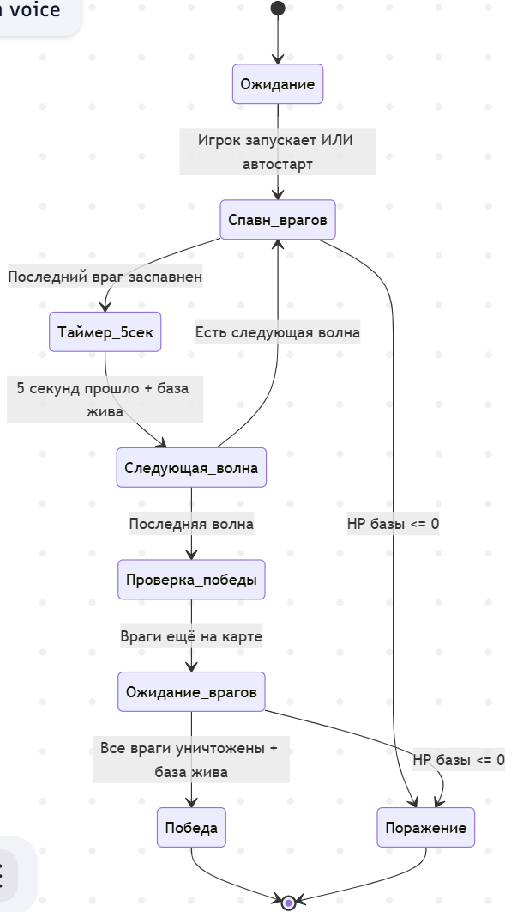

Схема показывает полный цикл волны от запуска до проверки окончания матча. После уничтожения всех врагов волны игрок получает паузу перед следующей волной.

---

# УПРАВЛЕНИЕ И ИНТЕРФЕЙС

Игра поддерживает управление мышью и клавиатурой на ПК, сенсорное управление на мобильных устройствах. Интерфейс адаптируется под платформу автоматически.

**Детализация BuldBar:**

Панель содержит 4 слота, заполненных активными башнями из колоды игрока. Под каждой башней отображается:

```
[Иконка башни]
[Стоимость постройки]
[Цветной индикатор доступности]
```

- **Зелёный индикатор** — достаточно золота для постройки
- **Красный индикатор** — недостаточно золота
- **Стоимость** учитывает уровень мастерства (скидка до 3%)

---

**Постройка башен**

**На ПК:**

1. Левый клик на слоте башни в BuldBar
2. Режим постройки активируется, башня следует за курсором
3. Сетка тайлов подсвечивается:
   - **Зелёная клетка** — можно построить
   - **Красная клетка** — занято или запрещено
4. Левый клик по зелёной клетке → башня построена
5. Правый клик или ESC → отмена режима постройки

**На мобильных устройствах:**

1. Долгое нажатие на слоте башни в BuldBar
2. Башня "отрывается" от слота и следует за пальцем (Drag & Drop)
3. Сетка подсвечивается аналогично ПК
4. Отпускание пальца на зелёной клетке → башня построена
5. Отпускание пальца вне карты или на красной клетке → отмена

**Ограничения на постройку:**

- Нельзя строить на пути врагов
- Нельзя строить на клетках, занятых другими башнями
- Нельзя строить на декоративных объектах (камни, деревья, вода)
- Нельзя строить при недостатке золота

**Визуальная обратная связь:**

При активации режима постройки появляется полупрозрачный превью башни с кругом радиуса атаки. Цвет превью меняется:
- **Зелёный** — клетка свободна, достаточно золота
- **Красный** — клетка занята или запрещена

---

**Управление построенными башнями**

Клик на построенную башню открывает её меню с несколькими вкладками.

**Основное меню башни:**

```
┌─────────────────────────────┐
│ [Иконка] Название   Lvl 3/10│
├─────────────────────────────┤
│ Урон:        150 → 165 (+15)│
│ Перезарядка: 0.8 → 0.75(-0.05)│
│ Дальность:   250 → 260 (+10)│
├─────────────────────────────┤
│ [Улучшить: 200💰]           │
│ [Стратегия: First] [Закрыть]│
└─────────────────────────────┘
```

**Элементы меню:**

| Элемент | Действие | Описание |
|---------|----------|----------|
| Кнопка "Улучшить" | Повысить уровень башни | Стоимость зависит от текущего уровня |
| Кнопка "Стратегия" | Переключить режим атаки | Доступно только для некоторых башен |
| Отображение параметров | Информация | Текущие и будущие значения после улучшения |

**Стратегии атаки:**

Доступны для башен, атакующих одиночные цели (Пушка, Арбалет, Берсерк, Палач, Телепорт, Минотавр, Яд, Улей).

| Стратегия | Приоритет цели | Применение |
|-----------|----------------|------------|
| First | Враг, прошедший наибольшее расстояние по пути | Для уничтожения прорвавшихся врагов |
| Last | Враг, только появившийся на карте | Для контроля начала пути |
| Random | Случайный враг в радиусе | Для равномерного распределения урона |

Переключение стратегии происходит циклически: First → Last → Random → First.

**Управление волнами**

**Кнопка Play/Pause:**

- **До запуска первой волны:** кнопка отображает иконку Play. Клик запускает волну 1.
- **Во время волны:** кнопка отображает иконку Pause. Клик ставит игру на паузу (только в Кампании и Песочнице, не в PvP).

**Кнопка Speed Up:**

- **В обычном режиме:** клик устанавливает скорость игры ×8
- **В ускоренном режиме:** клик возвращает скорость ×1
- **Альтернативное поведение:** если волна ещё не запущена, кнопка работает как вторая кнопка Play

Скорость игры влияет на:
- Движение врагов
- Перезарядку башен
- Анимации атак
- Генерацию золота башнями Банк
- Периодические эффекты (яд, регенерация боссов)

Скорость игры **не влияет** на:
- Интерфейс

**Пауза:**

В режиме паузы:
- Все враги останавливаются
- Башни не атакуют
- Таймеры останавливаются
- Игрок **может** строить и улучшать башни
- Меню башен остаются доступными

Пауза недоступна в режиме PvP.

---

**Управление колодой (вне боя)**

Колода — это набор из 4 башен, доступных для постройки в матче. Управление колодой происходит в главном меню.

**Открытие редактора колоды:**

Главное меню → Кнопка "Колода"

**Интерфейс редактора:**

```
Активная колода (4 слота):
┌──────┬──────┬──────┬──────┐
│ [1]  │ [2]  │ [3]  │ [4]  │
│Пушка │Артил.│ Лёд  │ Банк │
└──────┴──────┴──────┴──────┘

Коллекция (все открытые башни):
┌──────┬──────┬──────┬──────┐
│Арбалет│Телеп.│ Яд  │Минот.│
│ Lvl 5 │ Lvl 3│ Lvl 7│ Lvl 2│
└──────┴──────┴──────┴──────┘
```

**Замена башни в колоде:**

1. Клик на слот в активной колоде → слот подсвечивается
2. Клик на башню в коллекции → башни меняются местами
3. Нельзя добавить в колоду башню, которая уже там есть
4. Нельзя добавить в колоду не открытую башню (have = false)

---

**Экран окончания матча:**

После победы или поражения появляется экран с результатами:

```
┌─────────────────────────────┐
│         ПОБЕДА / ПОРАЖЕНИЕ   │
├─────────────────────────────┤
│ Очки:          1250          │
│ Заработано:    450 💰        │
│ Лучший счёт:   2100          │
├─────────────────────────────┤
│ Звёзды: ⭐⭐⭐ (Кампания)    │
├─────────────────────────────┤
│ Награды:                     │
│ [Сундук] [+15💰] [+5 XP]    │
├─────────────────────────────┤
│ [Повтор] [Главное меню]      │
└─────────────────────────────┘
```

**Для режима Кампания:**

Дополнительно отображается экран открытия сундука с анимацией выпадения карт.

**Для режима PvP:**

Дополнительно отображается статистика:
- MVP башня (наибольший урон)
- Количество убийств по типам врагов
- График урона обоих игроков
- Время, которое продержалась каждая база

---

**Горячие клавиши (только ПК):**

| Клавиша | Действие |
|---------|----------|
| 1, 2, 3, 4 | Выбрать башню из слота 1-4 для постройки |
| ESC | Отменить режим постройки / Закрыть открытое меню |
| Space | Пауза / Продолжить |
| S | Ускорение ×8 / Обычная скорость |
| P | Запустить волну / Пропустить ожидание |
| Tab | Открыть/закрыть меню статистики |

---

**Адаптация интерфейса под платформы**

**ПК (1600×900 и выше):**

- Меню башен открываются справа от башни
- Используются всплывающие подсказки при наведении курсора
- Кнопки имеют размер 60×60 пикселей
- Шрифт 12-16 пикселей

**Мобильные устройства:**

- Меню башен открываются в центре экрана
- Всплывающие подсказки недоступны
- Кнопки имеют размер 120×120 пикселей (удобно для пальцев)
- Шрифт 24-48 пикселей
- Карта масштабируется, чтобы заполнить весь экран по высоте

**Разрешения экрана:**

Игра поддерживает следующие разрешения на ПК:
- 1024×576 (минимальное)
- 1280×720
- 1600×900 (рекомендуемое)
- 1920×1080

На мобильных устройствах разрешение определяется автоматически.

---

### Рисунок 10: Общий флоу игры
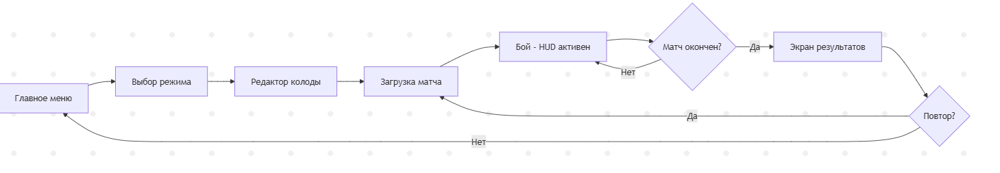

Схема показывает основной цикл игры: меню → настройка колоды → бой → результаты → меню. Игрок может повторить матч без возврата в главное меню.


### Рисунок 11: Процесс постройки башни
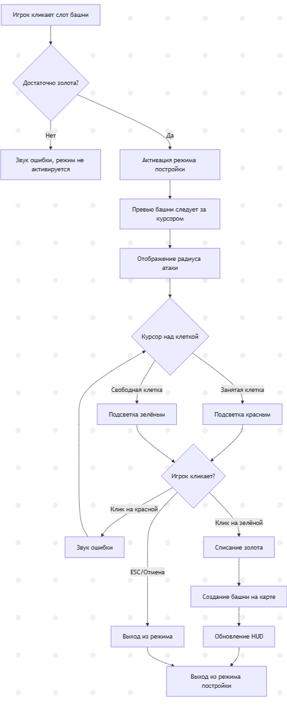

Схема показывает детальный процесс постройки башни: проверка золота → режим постройки → выбор клетки → подтверждение или отмена.


### Рисунок 12: Управление построенной башней
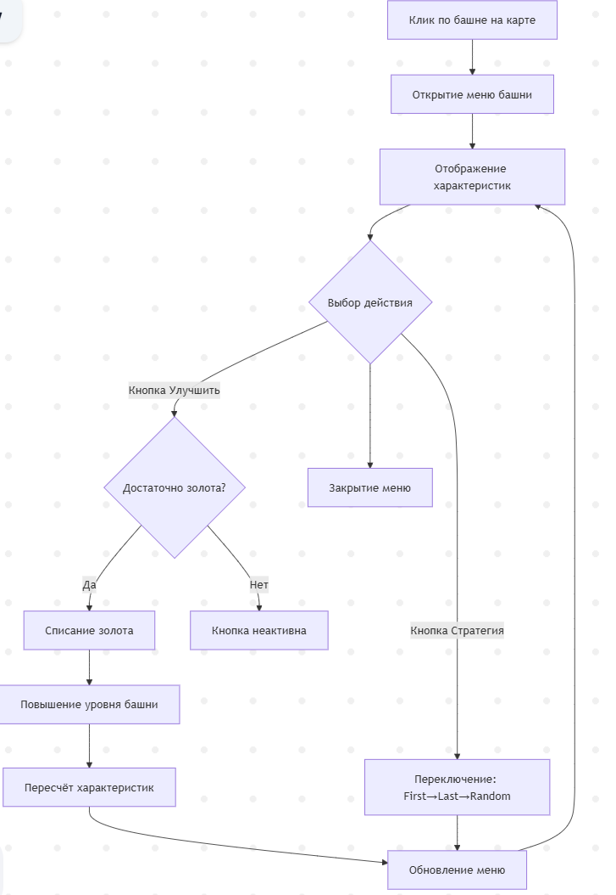


Схема показывает взаимодействие с меню башни: открытие → выбор действия → улучшение/продажа/изменение стратегии → закрытие меню.

### Рисунок 13: Управление волнами в бою
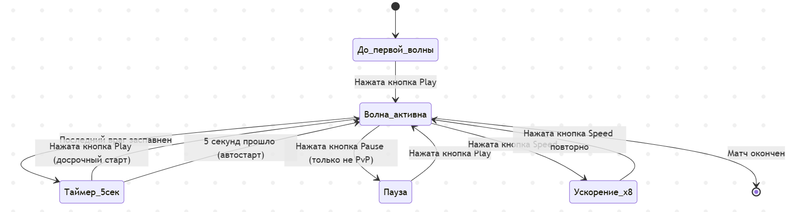
Схема показывает управление состоянием матча: запуск волн, пауза, ускорение. Игрок может переключаться между состояниями до окончания матча.
---

# ПЛАТФОРМЫ И ТРЕБОВАНИЯ

Игра разработана на движке Godot 4 и поддерживает кроссплатформенный запуск на ПК и мобильных устройствах. Интерфейс автоматически адаптируется под разрешение и тип управления.

**Поддерживаемые платформы:**

| Платформа | Минимальная версия ОС | Тип управления | Статус поддержки |
|-----------|----------------------|----------------|------------------|
| Windows | Windows 10 (64-bit) | Мышь + клавиатура | Полная поддержка |
| Linux | Ubuntu 20.04+ / любой дистрибутив с Vulkan | Мышь + клавиатура | Полная поддержка |
| macOS | macOS 10.15+ | Мышь + клавиатура | Полная поддержка |
| Android | Android 7.0 (API 24+) | Сенсорный экран | Полная поддержка |
| iOS | iOS 12.0+ | Сенсорный экран | Полная поддержка |

**Системные требования (ПК):**

| Компонент | Минимальные | Рекомендуемые |
|-----------|-------------|---------------|
| Процессор | Intel Core i3 / AMD Ryzen 3 | Intel Core i5 / AMD Ryzen 5 |
| Оперативная память | 2 GB RAM | 4 GB RAM |
| Видеокарта | Встроенная графика с поддержкой Vulkan 1.0 | Дискретная GPU с Vulkan 1.2 |
| Место на диске | 150 MB свободного места | 300 MB свободного места |
| Разрешение экрана | 1024×576 | 1920×1080 |
| Интернет | Не требуется (кроме PvP) | Широкополосное подключение для PvP |

**Системные требования (мобильные устройства):**

| Компонент | Минимальные | Рекомендуемые |
|-----------|-------------|---------------|
| Процессор | 4-ядерный 1.5 GHz | 8-ядерный 2.0 GHz+ |
| Оперативная память | 2 GB RAM | 4 GB RAM |
| Видеокарта | Mali-G51 / Adreno 506 / PowerVR GT7600+ | Mali-G76 / Adreno 640+ |
| Место на диске | 200 MB свободного места | 400 MB свободного места |
| Разрешение экрана | 1280×720 | 1920×1080+ |
| Интернет | Не требуется (кроме PvP) | 4G/Wi-Fi для PvP |

**Настройки графики:**

Игра автоматически определяет производительность устройства и устанавливает оптимальные настройки. Доступны следующие параметры:

- **Сглаживание:** Выкл / FXAA / TAA
- **VSync:** Выкл / Вкл
- **Ограничение FPS:** 30 / 60 / 120 / Без ограничений

**Языковая поддержка:**

Игра поддерживает следующие языки интерфейса:
- Английский (English)
- Русский (Русский)

Язык можно изменить в настройках в любой момент. Переключение происходит мгновенно без перезапуска игры.

**Особенности платформ:**

**Windows:**
- Поддержка DirectX 12 и Vulkan
- Оконный и полноэкранный режимы
- Горячие клавиши для всех действий
- Настройка разрешения экрана: 1024×576, 1280×720, 1600×900, 1920×1080

**Linux:**
- Только Vulkan (OpenGL не поддерживается)
- Требуется libvulkan1
- Поддержка Wayland и X11
- Может потребоваться установка дополнительных драйверов GPU

**macOS:**
- Использует Metal через MoltenVK
- Поддержка Retina-дисплеев
- Полная поддержка трекпада (жесты не используются)
- Минимальная версия: 10.15 Catalina

**Android:**
- Поддержка 64-bit архитектур (ARM64-v8a, x86_64)
- Требуется OpenGL ES 3.0+ или Vulkan 1.0+
- Адаптация под вырезы экрана (notch)
- Поддержка жестов навигации
- Автосохранение при сворачивании приложения

**iOS:**
- Поддержка iPhone 6s и новее
- Поддержка iPad (5 поколение) и новее
- Адаптация под Safe Area (вырезы)
- Поддержка Face ID / Touch ID (не используется в текущей версии)
- Требуется 64-bit архитектура

**Режим PvP (онлайн):**

Для игры в режиме PvP требуется постоянное подключение к интернету. Игра использует WebSocket-соединение с сервером.

**Требования к соединению:**
- Минимальная скорость: 1 Mbps (входящая/исходящая)
- Рекомендуемая скорость: 5 Mbps
- Задержка (ping): < 150 ms для комфортной игры
- Тип соединения: Wi-Fi или 4G/5G (3G не рекомендуется)

---

# ЛИЦЕНЗИЯ И ИСПОЛЬЗОВАНИЕ

**Все права защищены. Коммерческое и некоммерческое использование запрещено.**

Этот проект является **закрытым исходным кодом** и предоставляется исключительно для ознакомления и личного использования. Любое использование кода, ассетов, дизайна или механик игры в других проектах **строго запрещено** без письменного разрешения правообладателя.

**Запрещается:**

- Копирование кода или его частей в другие проекты (коммерческие или некоммерческие)
- Использование графических ассетов, звуков, музыки, текстур в других играх или приложениях
- Модификация и распространение изменённых версий игры
- Декомпиляция, реверс-инжиниринг или извлечение ресурсов из скомпилированных файлов
- Создание производных работ на основе кода или игровых механик
- Публикация игры или её модификаций в магазинах приложений (Google Play, App Store, Steam и т.д.)
- Использование игры в образовательных проектах без согласования
- Коммерческое использование в любой форме (продажа, реклама, донаты, подписки)

**Разрешается:**

- Запуск игры на личных устройствах для ознакомления
- Изучение кода в образовательных целях **без копирования**
- Создание скриншотов и видео геймплея для личного использования

**Ответственность:**

Нарушение условий данной лицензии влечёт за собой юридическую ответственность в соответствии с законодательством о защите авторских прав. Правообладатель оставляет за собой право требовать:
- Прекращения использования материалов проекта
- Удаления производных работ
- Возмещения убытков

**Отказ от гарантий:**

Игра предоставляется "как есть", без каких-либо гарантий. Разработчик не несёт ответственности за:
- Потерю данных прогресса игрока
- Технические неполадки на устройствах пользователей
- Несовместимость с определённым оборудованием или ОС
- Любые прямые или косвенные убытки от использования игры

**Версия лицензии:** 1.0  
**Дата последнего обновления:** 2026

---
